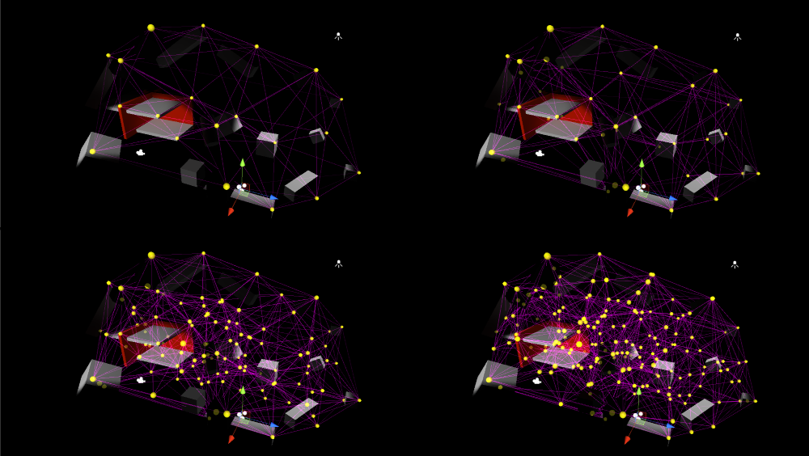
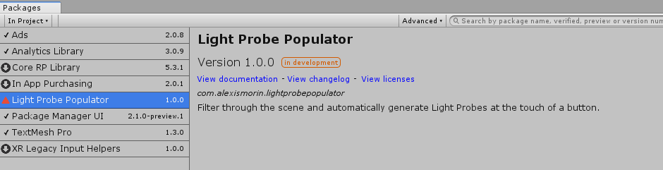
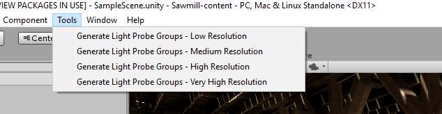
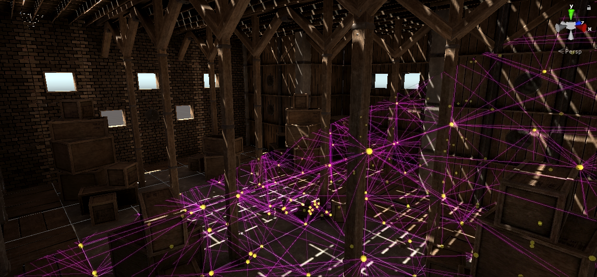

# Light Probe Populator
## Automatic Unity Light Probe Group Generation

While I've found a few different automated light probe solutions for Unity, I couldn't easily find a free, easily accessible one - why not take a few minutes off at work and hash one out?

#### Why do I need light probes?
 As the Unity documentation puts it:
> Light Probes provide a way to capture and use information about light that is passing through the empty space in your scene.
>Light probes store “baked” information about lighting in your scene. The difference is that while lightmaps store lighting information about light hitting the surfaces in your scene, light probes store information about light passing through empty space in your scene.

If you're more familiar with Unreal Engine, this package is roughly what the Lightmass Importance Volume does for you, albeit in a slightly less optimized fashion.

### Install process
This is a plugin that makes use of Unity's new *Package Manager* feature. Just drop the *com.alexismorin.lightprobepopulator* folder into your *packages* folder (found at the same level as your Assets folder) and it should work out-of-the-box. If you're using an older version of Unity, navigate inside the *com.alexismorin.lightprobepopulator* folder and then just drag the *Editor* folder you find there anywhere in your project hierarchy.

### Usage
Just select one of the four options in the *Tools* menu item.
 - *Low Resolution* is best suited for stylized or mobile games
 - *Medium Resolution* is good for PC or Console
 - *High Resolution* is good if you're doing realtime rendering.
 - *Very High Resolution* is kind of overkill - use if you're trying to compete with the Unity demo team.

Created at [Imaginary Spaces](https://imaginary-spaces.com/) in the timespan of a coffee break.